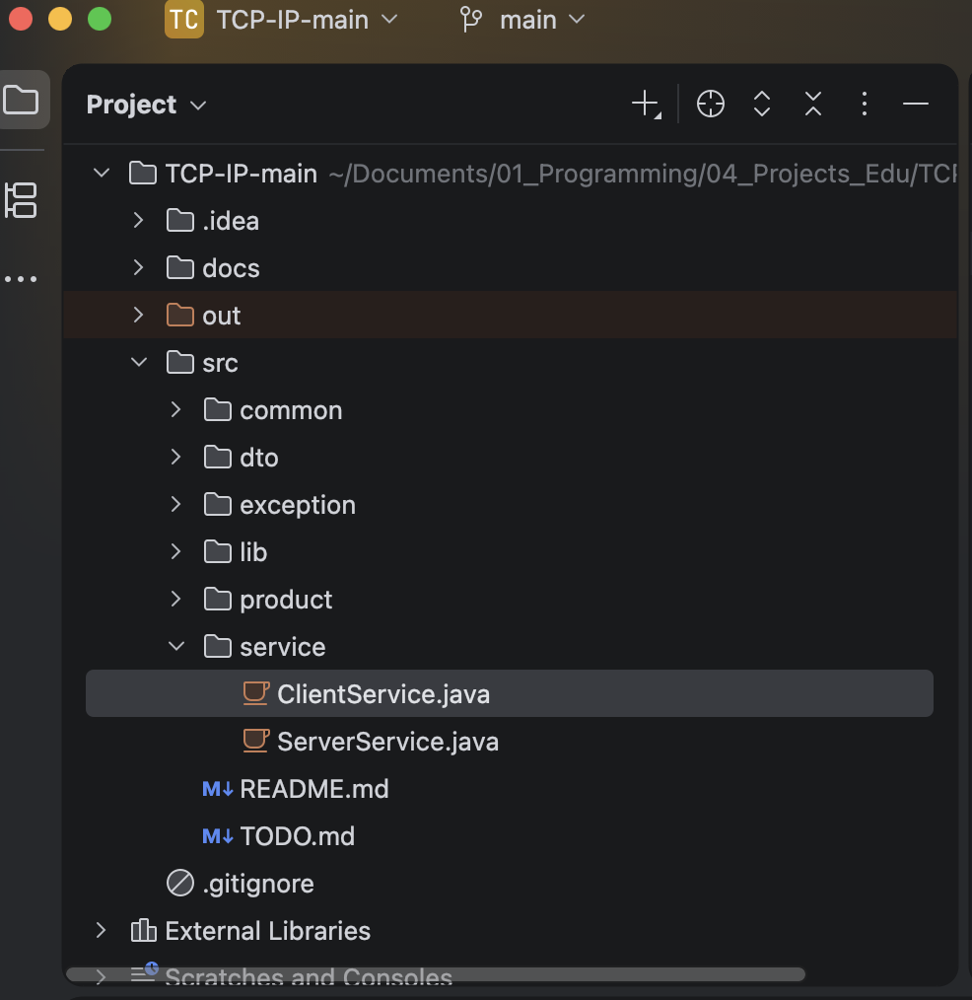
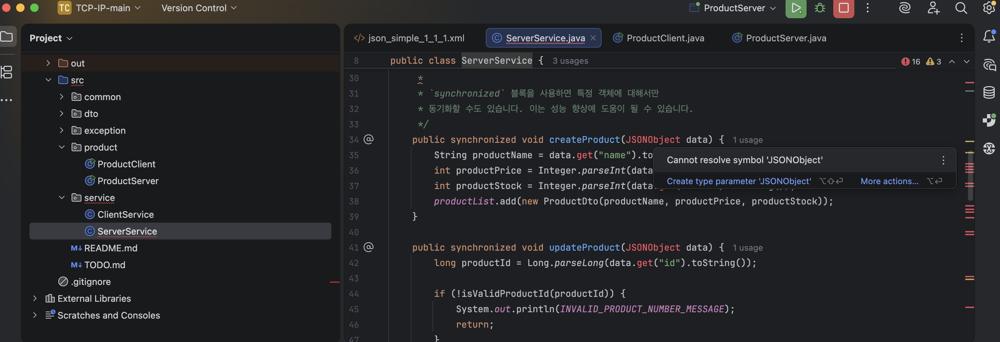
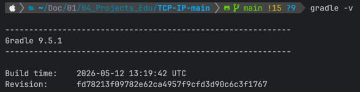
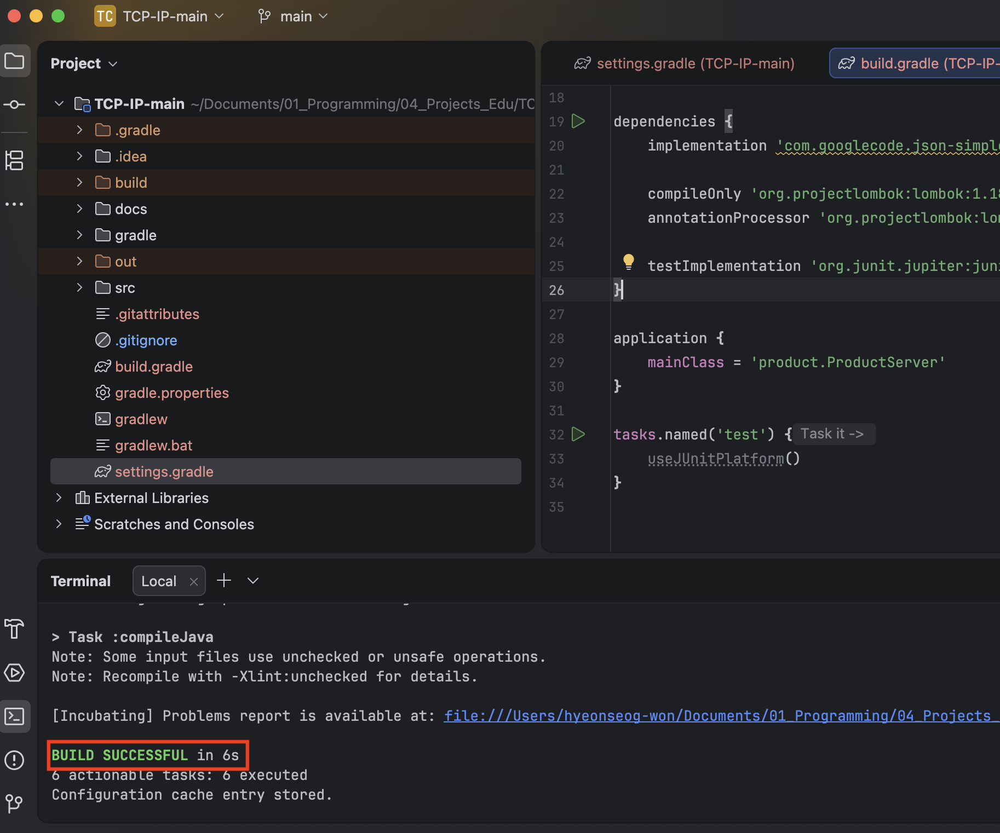
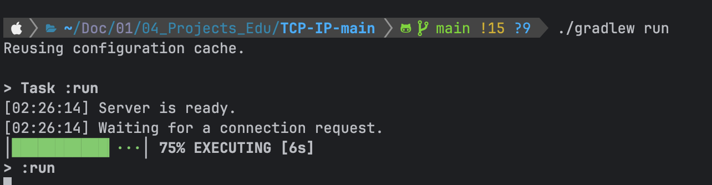
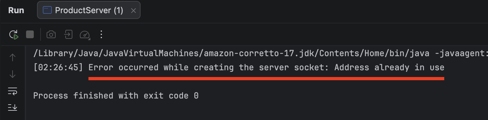
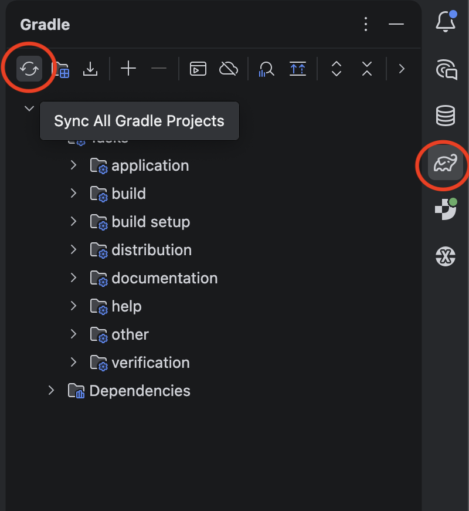
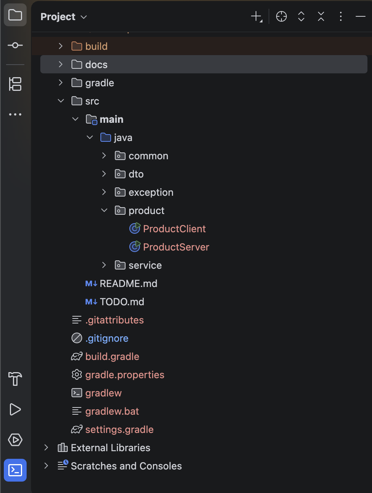

# 순수 Java 프로젝트 Gradle 전환 방법

## 1. 전환 배경

기존 프로젝트는 IntelliJ IDEA에서 직접 JAR 파일을 등록하여 실행하는 순수 Java 프로젝트였다.

기존에는 `json-simple`, `lombok` 같은 외부 라이브러리를 Gradle/Maven이 아니라 IntelliJ 프로젝트 설정에 직접 연결해서 사용했다.

예를 들어 `.idea/libraries/json_simple_1_1_1.xml`에는 다음과 같이 외부 경로가 직접 들어가 있었다.

```xml
<component name="libraryTable">
  <library name="json-simple-1.1.1">
    <CLASSES>
      <root url="jar://$PROJECT_DIR$/../../../../KB_workspace/7_java/lib/json-simple-1.1.1.jar!/" />
    </CLASSES>
    <JAVADOC />
    <SOURCES />
  </library>
</component>
```

이 방식은 내 로컬 환경에서는 동작할 수 있지만, 다른 사람이 프로젝트를 받으면 해당 경로가 존재하지 않기 때문에 라이브러리를 찾지 못할 수 있다.

나 또한 사진과 같이 프로젝트가 제대로 인식되지 않고, 라이브러리 오류가 발생했다.




처음에는 다음처럼 프로젝트 내부 lib 폴더를 바라보도록 수정하는 방법도 고려할 수 있다.

```xml
<component name="libraryTable">
    <library name="json-simple-1.1.1">
        <CLASSES>
            <root url="jar://$PROJECT_DIR$/lib/json-simple-1.1.1.jar!/"/>
        </CLASSES>
        <JAVADOC/>
        <SOURCES/>
    </library>
</component>
```

하지만 이번 작업에서는 JAR 파일을 직접 관리하지 않고, Gradle 의존성으로 관리하는 방식으로 전환했다.

따라서 최종적으로는 `.idea/libraries/`에 있는 기존 라이브러리 설정을 제거하고, `build.gradle`에서 의존성을 관리한다.

---

## 2. Gradle 전환 방식 검토

### 2.1 최소 변경 방식

기존 소스 구조를 최대한 유지하고, `build.gradle`에서 소스 디렉터리를 직접 지정하는 방식이다.

필요한 설정은 다음과 같다.

- `settings.gradle`
- `build.gradle`
- Gradle Wrapper
- Java 버전 지정
- 기존 `src` 폴더를 소스 디렉터리로 지정
- `json-simple` 의존성 추가
- `lombok` 의존성 추가
- 실행할 `mainClass` 지정

이 방식은 빠르게 전환할 수 있지만, Gradle 표준 구조와는 다소 차이가 있다.

---

### 2.2 권장 방식

Gradle 표준 구조에 맞게 프로젝트 구조를 변경하는 방식이다.

최종적으로 다음 구조를 목표로 한다.

```
TCP-IP-main/
  src/
    main/
      java/
        common/
        dto/
        exception/
        product/
        service/
  build.gradle
  settings.gradle
  gradlew
  gradlew.bat
  gradle/
```

기존에 직접 관리하던 JAR 파일은 가능하면 제거하고, Gradle 의존성으로 관리한다.

이번 작업에서는 이 방식을 선택했다.

---

## 3. Gradle 설치 확인

먼저 로컬에 Gradle이 설치되어 있는지 확인한다.

```bash
gradle -v
```

설치되어 있지 않으면 다음과 같은 오류가 발생할 수 있다.

```
command not found: gradle
```

macOS에서는 Homebrew로 Gradle을 설치할 수 있다.

```
brew install gradle
```

설치 후 다시 확인한다.

```
gradle-v
```



---

## 4. Gradle 초기화

프로젝트 루트 디렉터리에서 Gradle 초기화를 진행한다.

```
gradle init
```

이미 파일이 있는 프로젝트에서 실행하면 다음과 같은 안내가 나온다.

```
Found existing files in the project directory: '/경로/TCP-IP-main'.
Directory will be modified and existing files may be overwritten. Continue? (default: no) [yes, no]
```

이 질문은 현재 디렉터리에 이미 파일이 있는데, Gradle 초기화 과정에서 일부 파일이 생성되거나 덮어써질 수 있음을 알려주는 것이다.

여기서 중요한 것은 표시된 경로가 실제 프로젝트 루트인지 확인하는 것이다.

예를 들어 다음처럼 현재 프로젝트 경로가 정확히 표시되면 계속 진행해도 된다.

```
/Users/사용자명/KB_workspace/TCP-IP-main
```

반대로 `/private/var/...`, `/tmp/...`처럼 임시 디렉터리가 표시된다면 잘못된 위치에서 실행 중일 수 있으므로 `no`를 입력하고 현재 경로를 다시 확인해야 한다.

프로젝트 경로가 정확하다면 `yes`를 입력한다.

```
yes
```

---

### 선택한 옵션

이번 프로젝트에서는 기존 순수 Java 프로젝트를 Gradle 프로젝트로 전환하는 것이 목적이므로 `Application`이 아니라 `Basic`을 선택했다.

```
Select type of build to generate:
  1: Application
  2: Library
  3: Gradle plugin
  4: Basic (build structure only)
Enter selection (default: Application) [1..4] 4
```

이 질문은 어떤 종류의 Gradle 프로젝트를 만들 것인지 묻는 것이다.

각 선택지는 대략 다음 의미를 가진다.

```
1: Application
```

실행 가능한 애플리케이션 프로젝트를 새로 생성한다.

`main()` 메서드가 있는 샘플 코드나 `app` 디렉터리 구조가 생성될 수 있다.

```
2: Library
```

다른 프로젝트에서 가져다 쓰는 라이브러리 프로젝트 구조를 생성한다.

```
3: Gradle plugin
```

Gradle 플러그인을 개발하기 위한 프로젝트 구조를 생성한다.

```
4: Basic
```

기본 Gradle 빌드 구조만 생성한다.

기존 프로젝트에 Gradle을 붙이는 경우에는 이 방식이 가장 단순하다.

이번 작업은 이미 존재하는 Java 프로젝트를 Gradle로 전환하는 것이 목적이었기 때문에 `4: Basic`을 선택했다.

`1: Application`을 선택하면 새 애플리케이션 구조가 추가로 생성될 수 있어, 기존 프로젝트 구조와 섞이면서 불필요하게 복잡해질 수 있다.

---

Build Script DSL은 Groovy를 선택했다.

```
Select build script DSL:
  1: Kotlin
  2: Groovy
Enter selection (default: Kotlin) [1..2] 2
```

이 질문은 Gradle 설정 파일을 어떤 문법으로 작성할지 묻는 것이다.

```
1: Kotlin
```

`build.gradle.kts` 파일을 사용한다.

Kotlin 문법 기반이라 타입 안정성이 좋지만, 처음 Gradle을 다룰 때는 예제가 조금 낯설 수 있다.

```
2: Groovy
```

`build.gradle` 파일을 사용한다.

Java/Spring 프로젝트 예제에서 많이 볼 수 있고, 기존 자료를 참고하기 쉽다.

이번 프로젝트에서는 학습과 문서화 목적상 예제가 많은 Groovy 방식을 선택했다.

---

새 API 사용 여부는 기본값인 `no`를 선택했다.

```
Generate build using new APIs and behavior (some features may change in the next minor release)? (default: no) [yes, no]
```

이 질문은 Gradle의 새로운 API나 아직 변경 가능성이 있는 동작을 사용할지 묻는 것이다.

현재 목적은 최신 실험 기능을 써보는 것이 아니라, 기존 Java 프로젝트를 안정적으로 Gradle 기반으로 전환하는 것이다.

따라서 기본값인 `no`를 선택했다.

```
no
```

또는 그냥 Enter를 눌러도 기본값인 `no`로 진행된다.

초기화가 완료되면 다음과 같은 파일들이 생성된다.

```
build.gradle
settings.gradle
gradlew
gradlew.bat
gradle/
```

이후부터는 전역 Gradle 명령어인 `gradle`보다 프로젝트에 포함된 Gradle Wrapper를 사용하는 것이 좋다.

```
./gradlew clean build
```

Gradle Wrapper를 사용하면 다른 환경에서도 프로젝트가 지정한 Gradle 버전으로 빌드할 수 있다.

---

## 5. 주의: Application 선택 시 app 디렉터리 생성

`gradle init`에서 `Application`을 선택하면 Gradle이 새 애플리케이션 샘플 구조를 생성할 수 있다.

예를 들어 다음과 같은 구조가 생길 수 있다.

```
TCP-IP-main/
  app/
    build.gradle
    src/
      main/
        java/
```

이번 작업의 목적은 기존 프로젝트를 그대로 Gradle 프로젝트로 전환하는 것이었기 때문에, `Application` 방식은 불필요하게 구조를 복잡하게 만들 수 있었다.

따라서 기존 프로젝트 전환 목적이라면 `Basic`을 선택한 뒤 직접 `build.gradle`을 구성하는 방식이 더 적절했다.

---

## 6. build.gradle 설정

`Basic`으로 초기화하면 Java 빌드 설정이 자동으로 들어가지 않는다.

그래서 `build.gradle`에 Java/Application 플러그인과 의존성을 직접 추가했다.

```
plugins {
    id 'java'
    id 'application'
}

group = 'com.example'
version = '1.0.0'

java {
    toolchain {
        languageVersion = JavaLanguageVersion.of(17)
    }
}

repositories {
    mavenCentral()
}

dependencies {
    implementation 'com.googlecode.json-simple:json-simple:1.1.1'

    compileOnly 'org.projectlombok:lombok:1.18.36'
    annotationProcessor 'org.projectlombok:lombok:1.18.36'

    testImplementation 'org.junit.jupiter:junit-jupiter:5.11.4'
}

application {
    mainClass = 'product.ProductServer'
}

tasks.named('test') {
    useJUnitPlatform()
}
```

### 주요 설정 설명

`java` 플러그인은 Java 컴파일과 테스트를 위한 기본 작업을 제공한다.

`application` 플러그인은 `mainClass`를 지정하고 `./gradlew run`으로 애플리케이션을 실행할 수 있게 해준다.

`json-simple`은 기존에 직접 등록하던 JAR 파일을 Gradle 의존성으로 대체한 것이다.

`lombok`은 컴파일 시점에 애노테이션 처리가 필요하기 때문에 `compileOnly`와 `annotationProcessor`를 함께 설정했다.

`mainClass`는 서버 실행 클래스인 `product.ProductServer`로 지정했다.

---

## 7. settings.gradle 설정

`settings.gradle`은 프로젝트 이름을 지정하는 파일이다.

```
rootProject.name = 'TCP-IP-main'
```

---

## 8. 빌드 확인

Gradle Wrapper가 생성된 이후에는 전역 Gradle 명령어보다 `./gradlew`를 사용하는 것이 좋다.

```
./gradlew clean build
```

처음에는 다음과 같은 오류가 발생할 수 있다.

```
Task 'clean' not found in root project
```

이 오류는 `build.gradle`에 Java 플러그인이 설정되지 않았을 때 발생할 수 있다.

`build.gradle`에 다음 설정이 들어가면 `clean`, `build` 같은 작업이 등록된다.

```
plugins {
    id 'java'
    id 'application'
}
```

최종적으로 다음과 같이 빌드가 성공했다.

```
BUILD SUCCESSFUL
```



---

## 9. 실행 확인

현재 `build.gradle`의 실행 클래스는 다음과 같이 설정되어 있다.

```
application {
    mainClass = 'product.ProductServer'
}
```

따라서 아래 명령어를 실행하면 `ProductServer`가 실행된다.

```
./gradlew run
```

또는 IntelliJ에서 `ProductServer`의 `main()` 메서드를 직접 실행해도 된다.

서버/클라이언트 구조이므로 일반적으로 다음 순서로 확인한다.

1. `ProductServer` 실행
2. `ProductClient` 실행
3. 클라이언트와 서버 간 통신 확인

단, 서버를 이미 실행 중인 상태에서 다시 실행하면 다음과 같은 오류가 발생할 수 있다.

```
Address already in use
```

이는 같은 포트를 이미 사용 중이라는 의미다.

Gradle 전환 문제라기보다는 기존 서버 프로세스가 종료되지 않았거나, IntelliJ에서 서버를 중복 실행했을 때 발생할 수 있다.

이 경우 기존 실행 중인 서버를 중지한 뒤 다시 실행하면 된다.




---

## 10. IntelliJ 기존 설정 정리

Gradle 전환 후에는 기존 IntelliJ 직접 라이브러리 설정이 필요하지 않다.

정리 대상은 다음과 같다.

```
.idea/libraries/
out/
```

### 10.1 .idea/libraries 정리

기존에는 IntelliJ가 직접 JAR 파일을 참조하고 있었다.

```
.idea/libraries/json_simple_1_1_1.xml
.idea/libraries/lombok.xml
```

하지만 이제는 `build.gradle`에서 의존성을 관리하므로 해당 설정은 제거할 수 있다.

삭제 전에는 Gradle Reload를 먼저 수행하는 것이 좋다.

```
IntelliJ 오른쪽 Gradle 탭
→ Reload Gradle Project 또는 Sync All Gradle Projects
```



그 후 다음 중 하나의 방법으로 제거한다.

IntelliJ 메뉴에서 제거하는 방법:

```
File
→ Project Structure
→ Libraries
→ json-simple / lombok 제거
```

또는 파일을 직접 삭제한다.

```
.idea/libraries/
```

### 10.2 out 폴더 정리

`out/` 폴더는 IntelliJ가 생성한 기존 컴파일 결과물이다.

Gradle은 기본적으로 `build/` 폴더를 사용하므로 `out/`은 삭제해도 된다.

```
rm -rf out
```

삭제 후 다시 빌드한다.

```
./gradlew clean build
```

빌드가 성공하면 정리 완료다.

---

## 11. .gitignore 정리

Gradle 전환 후에는 빌드 결과물과 IDE 설정 파일이 Git에 올라가지 않도록 정리한다.

예시:

```
.gradle/
build/
out/

.idea/
*.iml
```

개인 프로젝트라면 `.idea/` 전체를 제외해도 된다.

팀 프로젝트라면 코드 스타일, 실행 설정 등 일부 `.idea` 파일을 공유할지 별도로 결정해야 한다.

---

## 12. 최종 결과

Gradle 전환 후 프로젝트는 다음 상태가 되었다.

```
Gradle Wrapper 생성 완료
build.gradle 설정 완료
settings.gradle 설정 완료
src/main/java 기반 구조 정리
json-simple Gradle 의존성 전환
lombok Gradle 의존성 전환
./gradlew clean build 성공
ProductServer / ProductClient 실행 확인
기존 .idea/libraries, out 정리
```

최종적으로 외부 JAR 파일을 직접 참조하던 방식에서 Gradle 기반 의존성 관리 방식으로 전환했다.

이를 통해 다음과 같은 장점이 생겼다.

- 로컬 절대 경로 의존 제거
- 다른 환경에서도 동일하게 빌드 가능
- 라이브러리 버전 관리가 명확해짐
- `./gradlew clean build`로 빌드 검증 가능
- IntelliJ 설정에 덜 의존하는 프로젝트 구조가 됨

---

## 최종 구조
